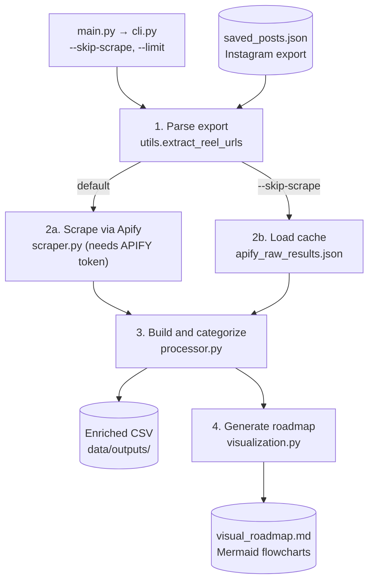

# How It Works

## Steps

1. **Parse export:** reads `data/saved_posts.json` and collects unique reel URLs (`--limit N` keeps the first N).
2. **Enrich:** either scrape the URLs with Apify in batches (saving `apify_raw_results.json`), or reuse that cache with `--skip-scrape`.
3. **Build and categorize:** turns results into a table, removes duplicates, and assigns each reel a category from caption and hashtag keywords. Saved as CSV.
4. **Generate roadmap:** groups reels by category and writes `visual_roadmap.md` with a Mermaid flowchart and a table per category.

`config.py` and `paths.py` provide shared settings and file locations to every step.
